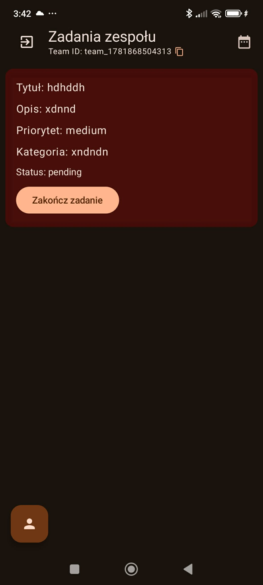
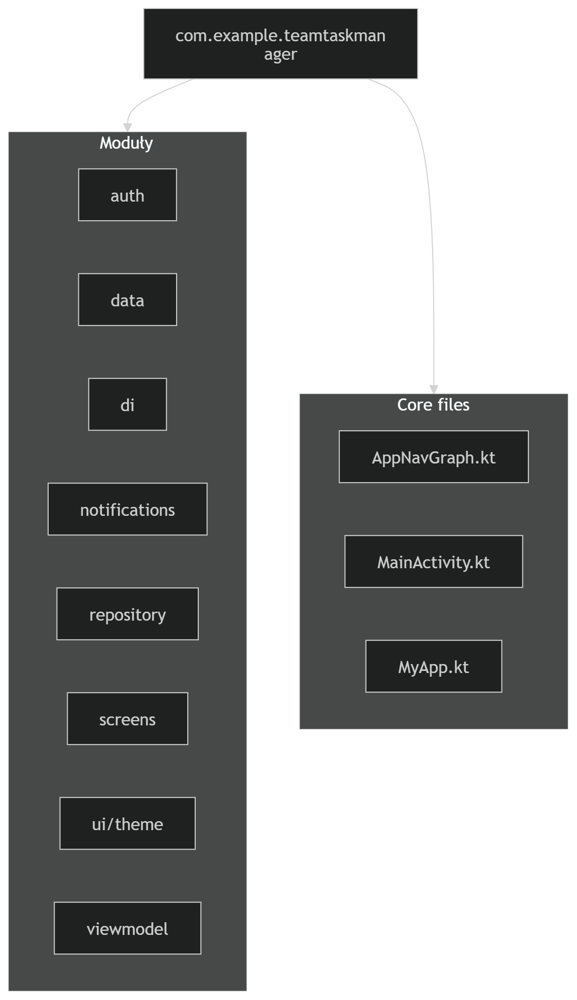
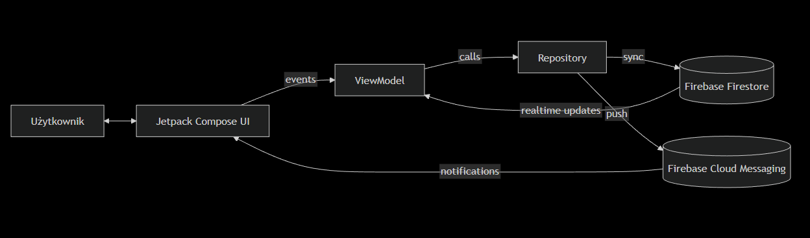
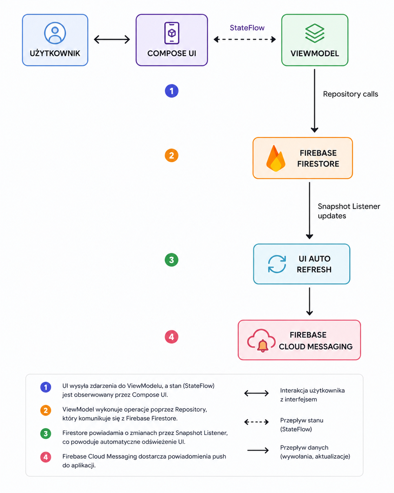

# Dokumentacja techniczna aplikacji Team Task Manager  

  

**Autor:** Bartosz Pawlaczyk

---

## Spis treści

1. **[Cel projektu](#cel-projektu)**  
2. **[Główne funkcjonalności](#glowne-funkcjonalnosci)**  
3. **[Wykorzystane biblioteki i technologie](#wykorzystane-biblioteki-i-technologie)**  
4. **[Architektura aplikacji (mvvm)](#architektura-aplikacji-mvvm)**  
5. **[Struktura projektu](#struktura-projektu)**  
6. **[Schemat przeplywu-danych](#schemat-przeplywu-danych)**  
7. **[Pierwsze kroki: Ekrany startowe](#pierwsze-kroki-ekrany-startowe)**

---

## Wprowadzenie

**Team Task Manager** to zaawansowana aplikacja mobilna na system Android, zaprojektowana do efektywnego zarządzania zadaniami wewnątrz zespołów w czasie rzeczywistym. System oferuje pełną synchronizację danych poprzez Firebase, system powiadomień lokalnych i push oraz hierarchiczny podział ról (Szef, Lider, Pracownik).

Aplikacja została zbudowana w oparciu o nowoczesne standardy Androida, wykorzystując:
- Jetpack Compose  
- architekturę MVVM  
- Hilt (dependency injection)

---

## Cel projektu

Głównym założeniem było stworzenie narzędzia eliminującego opóźnienia w komunikacji zespołowej. Kluczowe cele techniczne:

- **Reaktywność** – UI natychmiast reaguje na zmiany w Firestore (Snapshot Listeners)
- **Skalowalność** – możliwość łatwego dodawania modułów (np. kalendarz, analityka)
- **Bezpieczeństwo** – RBAC (Role-Based Access Control)

**[Powrót do spisu treści](#spis-tresci)**

---

## Główne funkcjonalności

System składa się z następujących modułów:

- **System autentykacji**
  - rejestracja i logowanie
  - automatyczne przypisanie roli użytkownika

- **Zarządzanie zespołem**
  - tworzenie TeamID
  - system zaproszeń
  - akceptacja członków przez Szefa

- **Tablica zadań**
  - tworzenie, edycja, usuwanie zadań
  - filtrowanie po statusach i priorytetach

- **Powiadomienia**
  - push notifications dla przypisanych zadań

- **Widok kalendarza**
  - wizualizacja deadline’ów

[Powrót do spisu treści](#spis-tresci)

---

## Wykorzystane biblioteki i technologie

- **Kotlin + Coroutines/Flow** – logika asynchroniczna  
- **Jetpack Compose (Material 3)** – UI  
- **Hilt (Dagger)** – dependency injection  
- **Firebase Firestore** – baza danych w czasie rzeczywistym  
- **Firebase Auth** – logowanie i rejestracja  
- **Firebase Cloud Messaging (FCM)** – push notifications  
- **Navigation Compose** – nawigacja  
- **ViewModel + Lifecycle** – zarządzanie stanem UI  
- **Coil** – ładowanie obrazów  

[Powrót do spisu treści](#spis-tresci)

---

## Architektura aplikacji (MVVM)

Aplikacja wykorzystuje wzorzec **Model-View-ViewModel**, zapewniający separację warstw.

### 1. View (Widok)
- Jetpack Compose  
- brak logiki biznesowej  
- obserwuje `StateFlow` z ViewModelu  

### 2. ViewModel
- pośrednik między UI a danymi  
- używa `viewModelScope`  
- przechowuje stan UI  

### 3. Model / Repository
- warstwa danych  
- komunikacja z Firebase Firestore  
- mapowanie dokumentów na obiekty `Task`  

[Powrót do spisu treści](#spis-tresci)

---

## Struktura projektu

  

[Powrót do spisu treści](#spis-tresci)

---

## Schemat przepływu danych

  

  

[Powrót do spisu treści](#spis-tresci)

---

## Pierwsze kroki: Ekrany startowe

### Ekran logowania i rejestracji

Proces onboardingu został zoptymalizowany pod minimalny wysiłek użytkownika.

#### Proces rejestracji:

**1. Szef**
- tworzy nowy zespół  
- otrzymuje unikalny `TeamID`

**2. Pracownik**
- wpisuje `TeamID`  
- trafia do listy oczekujących (pending)  
- wymaga akceptacji Szefa  

[Powrót do spisu treści](#spis-tresci)

---
